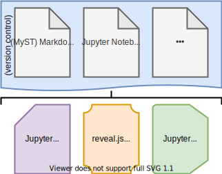
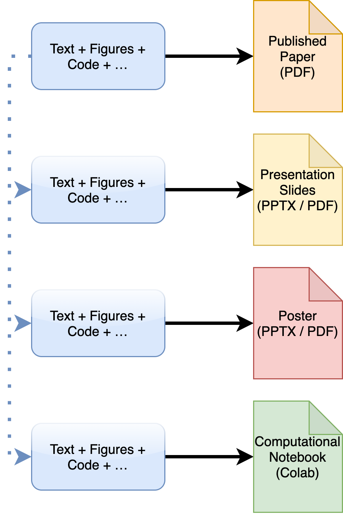
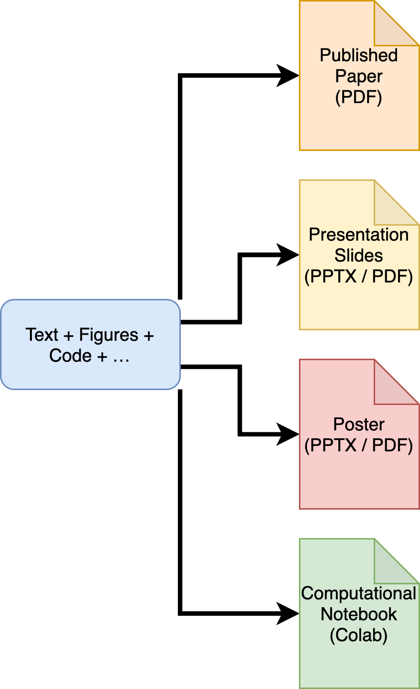
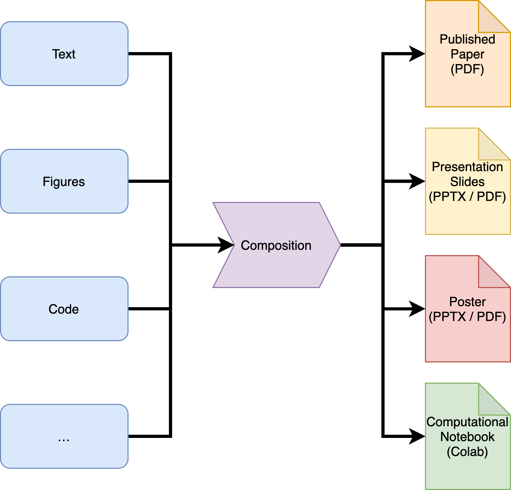
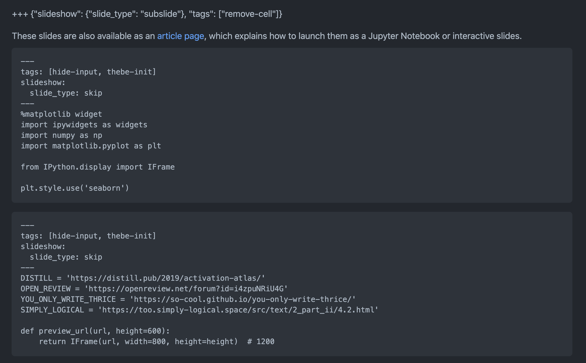
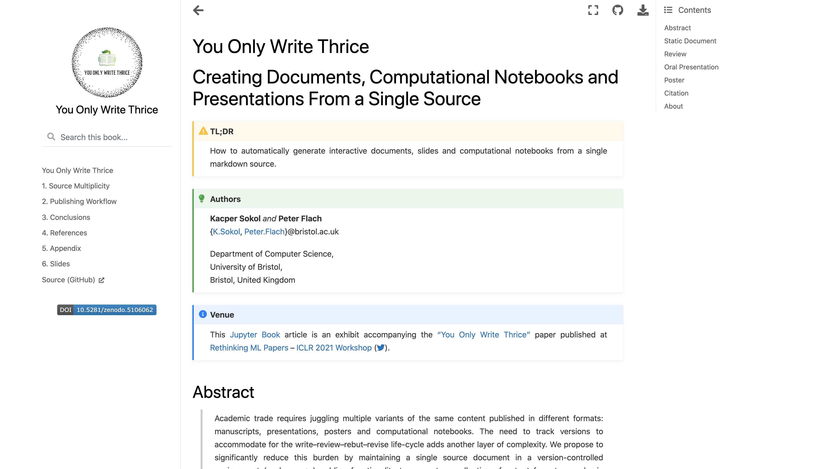
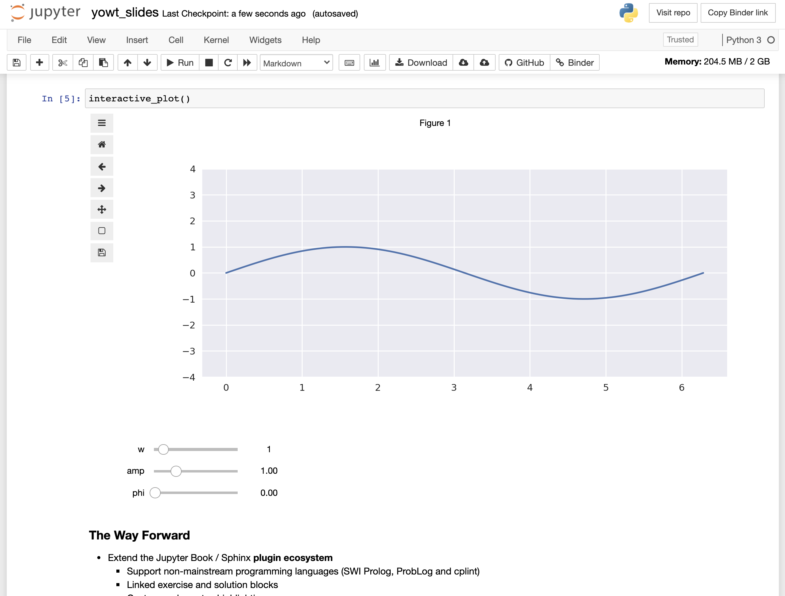
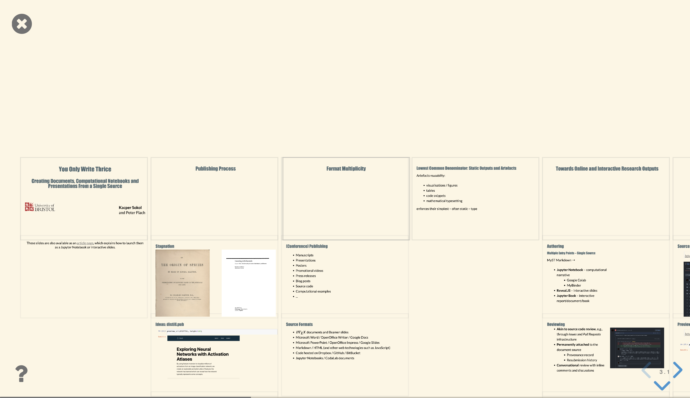
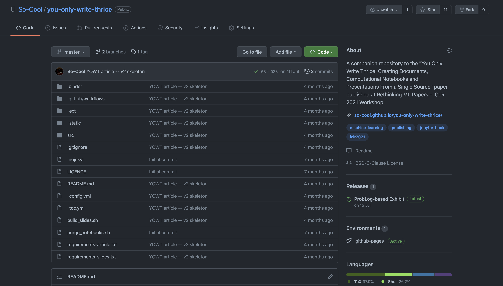
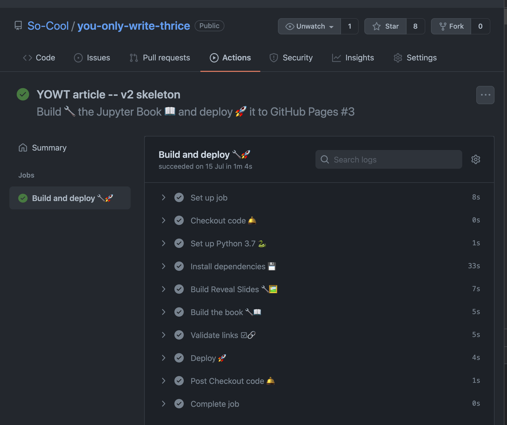

# Deliverable 9.3   \(Task 9.2: Training Platform and Material\)

## Training Platform Beta

*Kacper Sokol* and *Peter Flach*, University of Bristol

**Executive Summary:** The availability of training material is indispensable for knowledge transfer, developing a shared vision and nurturing the next generation of researchers. It is also an important driver of collaboration. To maximise impact, we are working towards a universal and flexible publishing platform, where diverse input formats -- LaTeX, Markdown, tables, figures, code, etc. -- can be collated into a large range of output formats such as (interactive) web documents, PDFs, (computational) notebooks, slide decks and the like. While useful on its own, this platform will also contribute to the creation of TAILOR-themed MOOCs, allowing the network partners to author diverse high-impact training material covering the latest developments in Trustworthy AI, Learning, Optimisation and Reasoning.

### Background

Academic trade requires juggling multiple variants of the same content published in different formats: manuscripts, presentations, posters and computational notebooks. The need to track versions to accommodate for the write--review--rebut--revise life-cycle adds yet another layer of complexity. With this deliverable we aim to reduce this burden by allowing authors to maintain a single source document in a version-controlled environment (such as `git`) that can be used to generate a collection of output formats popular in academia. To this end, we utilise various open source tools from the Jupyter scientific computing ecosystem and operationalise selected software engineering concepts. We offer a proof-of-concept workflow that composes _Jupyter Book_ (an online document), _Jupyter Notebook_ (a computational narrative) and _reveal.js_ slides from a single markdown source file. Hosted on GitHub, our approach supports change tracking and versioning, as well as a transparent review process based on the underlying code issue management infrastructure. An exhibit of our workflow can be previewed at [https://so-cool.github.io/you-only-write-thrice](https://so-cool.github.io/you-only-write-thrice/).

### Introduction

Despite immense technological advances permeating into our everyday life and work, scientific publishing has seen much less evolution. While moving on from hand- or type-written manuscripts to electronic documents allowed for faster and more convenient editing, dissemination and review, the (now obsolete and unnatural) limitations of the "movable type" publication format persist. Among others, this glass wall poses significant challenges to effective communication of scientific findings with their ever-increasing volume, velocity and complexity. To overcome these difficulties we may need to depart from the, de facto standard, _Portable Document Format_ (PDF) and set our sight on something more flexible and universal. In the past three decades the World Wide Web has organically evolved from a collection of hyper-linked text documents into a treasure trove of diverse and interactive resources -- a process that should inspire an evolution of the scientific publishing workflow.

A physical, printed and bound, copy of a research paper may have been mostly replaced by a PDF document viewable on a wide array of electronic devices, but both formats effectively share the same limitations. These constraints have recently become even more prominent with research venues requiring to publish supplementary materials that fall outside of the textual spectrum. Releasing _source code_ is advised to ensure reproducibility; _computational notebooks_ highlight individual methods, experiments and results; recording a short _promotional video_ helps to advertise one's research; _slides_ and _oral presentations_ (often pre-recorded nowadays) disseminate findings and foster discussions; and _posters_ graphically summarise research contributions. Notably, these artefacts are usually created independently and are distributed separately from the underlying paper -- nonetheless while disparate in appearance, form and function, they all share a common origin.

Without a designated place for each research output and a dedicated workflow to create and distribute them, they may end up scattered through the Internet. Code may be published on GitHub, computational notebooks distributed via Google Colab or MyBinder, and videos posted on YouTube. Slides and posters, on the other hand, tend to accompany the paper -- which itself is placed in proceedings -- sparingly with a somewhat outdated version of the article available through arXiv. While organising, distributing and linking all of these resources is a goal in itself, we shall first reconsider the authoring process responsible for their creation. Since delivering each format appears to be an independent task that requires a dedicated effort, having as many of these resources as possible generated from a single source could streamline the process and create a coherent narrative hosted in a single place. While as a community we created technology powerful enough to [train vision models in a web browser](https://teachablemachine.withgoogle.com), we find it somewhat difficult to see beyond the restrictive PDF format and hence increasingly lack publishing tools necessary to carry out our work effectively.

### New Publishing Paradigm

To streamline the process of creating academic content we propose to generate conference artefacts -- such as documents (papers), presentations (slides) and computational notebooks -- from a single source as depicted by the figure below. By storing all the information in a version-controlled environment (e.g., `git`) we can also track article evolution and revision, and facilitate a review process similar to the one deployed in software engineering and closely resembling the [OpenReview](https://openreview.net) workflow. Combining together research outputs as well as their reviews and revisions could improve credibility and provenance of scientific findings, thus simplifying re-submission procedures and taking the pressure off overworked reviewers. Additionally, including _interactive_ materials -- such as code boxes and computational notebooks -- in the published resources encourages releasing _working_ and accessible code.

Such an approach marks a departure from the most common practice where the original source materials underlying one's research become the basis of an article, which then serves as an "organ donor" for other desired output formats such as presentations, posters, blog posts and computational notebooks. We depict this standard academic writing workflow -- a separate source for each artefact, leading to duplicated inputs -- in the figure below.

An improvement over this approach is maintaining a collection of source materials within a single pool and using them to build a range of diverse research outputs -- the workflow offered by this deliverable. We call this paradigm, which is shown in the figure below, Single-In-Multiple-Out (SIMO).

A further refinement of such an approach would entail maintaining separate pools of input resources based on their type, allowing the user to freely mix, match and interweave them with help of a well-defined _composition_ toolkit to produce the desired output artefact. We call this version of the academic writing workflow Multiple-In-Multiple-Out (MIMO) and summarise it in the figure below.​

### The Workflow

The backbone of our workflow are documents written in [MyST Markdown](https://myst-parser.readthedocs.io/en/latest/) -- an extended markdown syntax that supports basic academic publishing features such as tables, figures, mathematical typesetting and bibliography management. Content written in this format is highly interoperable and can be converted to LaTeX, HTML, PDF or EPUB outside of the proposed system, thus serve as a source for, or a component of, other authoring environments. The key to automatically composing a variety of output formats is the syntactic sugar allowing to superficially split the content into _fragments_ and annotate them as shown by the figure below.

These _tags_ prescribe how each piece of prose, figure or code should be treated -- e.g., included, skipped or hidden -- when building different target formats. Then, Jupyter Book can process selected fragments to generate web documents and computational narratives, the latter of which may be launched as Jupyter Notebooks with either MyBinder or Google Colab -- see the figures below.

While this is already a step towards "reproducibility by design", having content that depends on code implicitly encourages releasing it as a software package that can be invoked whenever necessary, therefore improving reproducibility even further. The aforementioned source annotation can also specify a slide type and its content in a presentation composed with reveal.js (depicted by the figure below), streamlining yet another aspect of the academic publishing workflow. While each of these artefacts is destined for web publication, their trimmed version can also be exported to formats such as PDF or EPUB.

Notably, the source documents underlying these artefacts can be hosted on GitHub and built into the desired output formats automatically whenever a change is detected as shown by the figures below.

### Conclusions

With this deliverable we propose a novel publication workflow built around Jupyter Book, Jupyter Notebook and reveal.js. Our open source exhibit demonstrates how to create narrative-driven documents (peppered with executable code examples), computational notebooks and interactive slides, all from a single markdown source. Furthermore, we outline a strategy for hosting and disseminating such materials through version-controlled environments similar to code sharing repositories. Such a platform facilitates an intuitive review mechanism inspired by software engineering practice, thus endowing provenance and transparency to the scientific publication process. While the exhibit underlying this deliverable is currently a bare-bones proof-of-concept built from open-source tools, it shows the potential for transforming the current PDF workflow into an environment focused on content creators and reviewers. Given its practical nature, the deliverable is published as a template and an automated workflow, both of which are hosted on [GitHub](https://github.com/So-Cool/you-only-write-thrice). This repository holds the source of an online (interactive) document, a computational notebook and a presentation that are [built automatically](https://github.com/So-Cool/you-only-write-thrice/runs/3078064455) upon detecting any edits or changes, and which can be previewed [here](https://so-cool.github.io/you-only-write-thrice).

While addressing some of the main issues with current publishing practice, the proposed workflow is not (yet) a silver bullet and the underlying technology needs further development and refinement to mature into reliable software. Although the centrepiece of this deliverable is based exclusively on Python code examples, we publish additional documents built with this workflow that make use of non-mainstream programming languages such as [SWI Prolog](https://book-template.simply-logical.space/src/text/sphinx_prolog_swish.html), [cplint](http://cplint-template.simply-logical.space/src/text/sphinx_prolog_swish.html) and [ProbLog](https://problog-template.simply-logical.space/src/text/bayesian_networks-sp-mnb.html), highlighting flexibility of the proposed framework. Notably, the proposed publication toolkit is not as powerful as LaTeX, which benefits from decades of development and a rich ecosystem of packages, therefore any customisation or automation will require a bespoke plugin (see above) that may be slow to create and buggy at first. Nonetheless, without making the first step -- and addressing the disadvantages associated with it -- the publishing process will not benefit from the technology that we developed to make our research possible in the first place.

Part of this deliverable has been published by Kacper Sokol and Peter Flach as a [workshop paper](https://openreview.net/forum?id=i4zpuNRiU4G) ([arXiv preprint](https://arxiv.org/abs/2107.06639)) at ICLR 2021 -- _Beyond static papers: Rethinking how we share scientific understanding in ML_ -- under the "You Only Write Thrice: Creating Documents, Computational Notebooks and Presentations From a Single Source" title.
