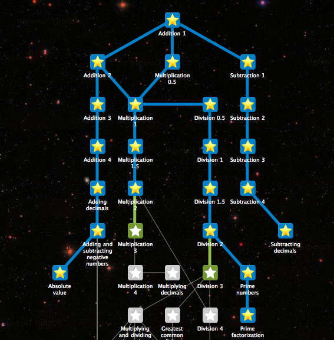

# Deliverable 9.5   \(Task 9.3: PhD Training\)

## Mapping of AI-oriented PhD programmes at TAILOR partners

_Kacper Sokol_ and _Peter Flach_, University of Bristol

**Executive Summary:** Understanding the availability of AI-oriented training opportunities offered by the TAILOR partners can benefit a number of tasks down the line. For example, it can be used to facilitate _research visits_, _cross-institutional courses_ or even become a foundation for _long-term collaboration_ and _partnership_. Universities that do not offer dedicated PhD training in AI, on the other hand, may use it as a reference material for designing _bespoke PhD programmes_, composing _individual courses_ and organising _thematic seminars_. This document describes our approach towards mapping AI training opportunities within Europe -- mostly offered by the TAILOR partners but also beyond. It lists relevant courses and materials available on the Internet and briefly annotates their content. It also touches upon different approaches to sharing the mapping insights with the TAILOR partners and the broader community. Finally, this document discusses the possibilities of designing a joint TAILOR PhD curriculum \(_Deliverable 9.6_\).

### Background

[TAILOR](https://tailor-network.eu/) -- Trustworthy AI through Integrating Learning, Optimisation and Reasoning -- is a network of over 54 partners across Europe, spanning universities and companies interested in pushing the boundaries of Artificial Intelligence \(AI\) research. A network of this size brings together diverse approaches and opportunities in training future generations of AI scientists, which are best exploited when properly indexed so that they are readily available to the interested parties. For example, such a resource can foster collaborations and knowledge transfer by encouraging PhD students to spend time at multiple TAILOR partners with relevant expertise. On the other hand, students looking for postgraduate courses could use it to identify suitable universities, research groups and supervisors; and companies interested in academic collaborations can scan it to find appropriate partners. Lastly, this mapping is a stepping stone towards designing a joint TAILOR PhD curriculum in AI, which can be freely adapted by the network members and beyond.

### Methodology

The mapping of AI-oriented training opportunities presented in this document is mainly based on Internet searches and inspection of partners' websites. These activities were restricted to information -- predominantly promotional materials about such offers -- published in the English language, however the teaching opportunities were included regardless of the tuition language. The search agenda was based on the list of partners enumerated in the TAILOR network research grant proposal. Information collected in this manner was then [presented to the TAILOR partners](https://hackmd.io/@so-cool/SyyeTzwOu), who were asked \(through a [Google Form](https://docs.google.com/forms/d/e/1FAIpQLScmy-DmrRT__mkhT_ePeiq5wVc-j2T8N0wZ8n6yDzN5B6i2eA/viewform?usp=sf_link)\) to provide feedback, point us towards missing training opportunities and rectify any incorrect statements. These activities were followed by direct emails to leads of TAILOR partners for whom we were still missing relevant information. The inclusion criteria were built around the notion of _structured PhD training opportunities in AI_, such as taught courses, PhD research curricula and agendas, cohort-based PhD recruitment, and the like. The current outcome is enclosed below. We intend to maintain this as a live document so that future additions and modifications can be easily accommodated \(see [Dissemination Strategy](deliverable.md#dissemination-strategy), below\).

### Partners and Initiatives

The training opportunities identified for each partner are listed and categorised below. URLs to relevant materials are included along each partner's name. Out of the 54 TAILOR network partners, 10 fall outside of this deliverable's scope as they are non-educational institutions or companies.

* \#44 Volkswagen Group Machine Research Lab
* \#45 Engineering -- Ingegneria Informatica SPA
* \#46 Tieto Finland Oy
* \#47 Philips Electronic Nederland B.V.
* \#48 Electricite de France
* \#49 ABB Sweden
* \#51 ZF Friedrichshafen AG
* \#52 Luxembourg Institute of Health
* \#53 Centraal Bureau voor de Statistiek
* \#54 Bosch

The remaining 44 partners offer relevant PhD-level training opportunities; these are listed and indexed below. For each partner, the first sub-bullet gives a programme, followed by a list of individual modules. The partner-specific list is followed by a list of cross-institutional initiatives.

* \#1 Linköping University
  * [WASP -- Wallenberg AI, Autonomous Systems and Software Program](https://liu.se/en/research/wasp-wallenberg-artificial-intelligence-autonomous-systems-and-software-program) \([Graduate School](https://wasp-sweden.org/graduate-school/), [Curricula](https://internal.wasp-sweden.org/graduate-school/curricula/)\)
    * Deep Learning and GANs
    * Graphical Models, Bayesian Learning, and Statistical Relational Learning
    * Artificial Intelligence and Society: Legal, Ethical and Societal Aspects of AI
    * Learning Theory and Reinforcement Learning
    * Scalable Data Science and Distributed Machine Learning
  * [PhD Studies at the Department of Computer and Information Science \(IDA\)](https://www.ida.liu.se/edu/grad/index.en.shtml)
* \#2 [Istituto di Scienza e Tecnologie dell'Informazione 'A. Faedo' \(CNR\)](https://www.isti.cnr.it/en/activities/teaching-and-training)
* \#3 [Inria Saclay -- Ile-de-France \(INRIA\)](https://www.inria.fr/en/inria-talents-phd) \([DATAiA](http://dataia.eu/index.php/en/institute/our-mission), [ELLIS](http://dataia.eu/partenaires/ellis-paris)\)
  * [Doctoral School](https://www.universite-paris-saclay.fr/en/doctoral-schools/sciences-and-technologies-information-and-communication)
  * [Institut Polytechnique de Paris offering](https://www.ip-paris.fr/education/phd-tracks/phd-track-informatique)
* \#4 University College Cork
  * [Science Foundation Ireland Centre for Research Training in Artificial Intelligence](http://crt-ai.cs.ucc.ie/)
    * Personalisation
    * Optimisation and Constraint Programming
    * Natural Language Processing
    * Machine Learning
    * Visual Media Processing
    * Ethics of Data Analytics and Fair, Accountable, Transparent AI
* \#5 KU Leuven
  * [Arenberg Doctoral School for Science, Engineering & Technology](https://set.kuleuven.be/phd)
* \#6 La Sapienza, Italy
  * [National PhD programme in Artificial Intelligence](https://www.uniroma1.it/en/notizia/national-phd-programme-artificial-intelligence-opportunity-our-country) \([Dottorato Nazionale in Intelligenza Artificiale](https://www.phd-ai.it/)\)
    * Federation of 5 PhD programmes in AI managed by large consortia of universities and public research bodies
      * AI for Health and Life Science \(Policlinico Univ. Campus Bio-Medico\)
        * Predicting illness and patient outcome
        * Healthcare and Well Being
        * Bio-robotics
        * Robotics for Health
        * Neuro-inspired AI
        * Bioinformatics
        * Precision medicine
      * AI for Agriculture \(Agrifood\) and the Environment \(Univ. di Napoli Federico II\)
        * Precision Farming
        * Food safety and traceability
        * Geo-Analytics
        * Ecological modelling
        * Biosensors
      * AI for Security and Cybersecurity \(Univ. di Roma La Sapienza\)
        * Cyber intelligence
        * Cybersecurity
        * Cyber defense
        * Cyber risk
      * AI for Industry 4.0 \(Politecnico di Torino\)
        * Virtual Factory
        * Predictive maintenance
        * Zero-Defect Manufacturing
        * Supply chain and Logistics
        * Predictive Analytics for Retail
      * AI for Society \(Univ. di Pisa\)
        * Data Science
        * Big Data
        * Human centric AI
        * Explainable AI
        * AI for Society
        * AI for personal assistance
        * AI for social interaction
        * AI for social good
    * Focus on foundational aspects of AI
      * Agent-based and Multi-agent Systems
      * Computational Intelligence
      * Constraints and Satisfiability
      * Information Retrieval and Knowledge Discovery
      * Knowledge Representation and Reasoning
      * Machine Learning
      * Natural Language Processing
      * Planning and Scheduling
      * Robotics
      * Semantic Technologies
      * Vision
    * Teach
      * AI Ethics
      * Data Science
      * Fuzzy and Computational Intelligence
      * Natural Language Processing
      * Computer Vision, Pattern Recognition
      * Multi Agent Systems, General and distributed Intelligence
      * Social Impact of AI
      * Distributed AI
      * Machine Learning
      * Sustainable AI
      * Knowledge representation & Reasoning
      * Robotics and embodied intelligence
      * Deep Learning
      * Social acceptability & adoption of AI
      * Quantum AI
      * Explainable AI
      * Methods for Explainable, Accountable, Interpretable and Verifiable Machine Learning
      * Human--machine interaction and intelligent systems
      * Game theory and Problem Solving
      * Planning
      * Data mining and knowledge discovery
      * Statistical and quantum physics
      * Complex network science and social network science
  * [PhD in Engineering in Computer Science](https://phd.uniroma1.it/web/ENGINEERING-IN-COMPUTER-SCIENCE_nD3514_EN.aspx)
    * Distributed Systems and Computer and Network Security
    * Algorithm Design
    * Data Management
    * Software Engineering
    * Artificial Intelligence I
    * Machine Learning
    * Network Infrastructures
    * Neural Networks
    * Formal Methods
    * Human Computer Interaction
    * Advanced Operating Systems and Virtualization
    * Capacity Planning
    * Web Information Retrieval
    * Internet of Things
    * Mobile Applications and Cloud Computing
    * Visual Analytics
    * Data Mining
    * Knowledge Representation and Semantic Technologies
    * System and Enterprise Security
    * Big Data Computing
    * Web Security and Privacy
    * Security Governance
    * Process Management and Mining
    * Large-scale Data Management
    * Seminars in Advanced Topics in Computer Science Engineering
    * Advanced Topics in Reinforcement Learning: From Theory to Practice
    * Vision and Perception in Human-Robot Interaction
    * Thinking Outside the Box: Adversarial Behavior and Unconventional Attack Vectors from Security Research
    * Incomplete Data -- Theory in Practice
    * Advanced Techniques for Finding Bugs in Real-world Software
    * High Performances Computing
* \#7 [Leiden University](https://www.universiteitleiden.nl/en/science/computer-science/research/artificial-intelligence--machine-learning)
* \#8 [Instituto Superior Técnico, Portugal](https://tecnico.ulisboa.pt/en/education/courses/phd-programmes/)
* \#9 [Universitat Pompeu Fabra](https://www.upf.edu/web/ai-ml/prospective-students) \([PhD programme](https://www.upf.edu/web/etic/structure)\)
* \#10 Alma Mater Studiorum - Università di Bologna
  * [PhD in Computer Science and Engineering](https://www.unibo.it/en/teaching/phd/2020-2021/computer-science-and-engineering) \(overview tab + [programme PDF](https://www.unibo.it/en/teaching/phd/2020-2021/attachments/cycle-36-phd-programme-table-computer-science-and-engineering/@@download/file/36_PhD%20Programme%20Table_ComputerScienceEngineering.pdf)\)
  * [PhD in Data Science and Computation](https://www.unibo.it/en/teaching/phd/2020-2021/data-science-and-computation) \(overview tab + [PDF programme](https://www.unibo.it/en/teaching/phd/2020-2021/attachments/cycle-36-phd-programme-table-data-science-and-computation/@@download/file/36_PhD%20Programme%20Table_DataScienceComputation.pdf)\)
* \#11 [Bar-Ilan University](https://www.cs.biu.ac.il/en/labs/57) \([PhD programme](https://cs.biu.ac.il/t3), [research topics](https://www.cs.biu.ac.il/en)\)
* \#12 [Eindhoven University of Technology](https://www.tue.nl/en/research/research-groups/artificial-intelligence/) \([AI Education](https://www.tue.nl/en/research/institutes/eindhoven-artificial-intelligence-systems-institute/ai-education/), [PDEng Data Science](https://www.tue.nl/en/education/graduate-school/pdeng-data-science/), [AI research](https://www.tue.nl/en/research/research-groups/artificial-intelligence/), [Master Data Science and Artificial Intelligence](https://www.tue.nl/en/education/graduate-school/master-data-science-and-artificial-intelligence/)\)
* \#13 [Centre National de la Recherche Scientifique](http://www.cnrs.fr/en/research)
* \#14 [Jožef Stefan Institute](https://www.ijs.si/ijsw/Artificial%20Intelligence%20E3)
* \#15 TU Darmstadt
  * [Artificial Intelligence at TU Darmstadt \(AI•DA\)](https://www.ai-da.tu-darmstadt.de/)
    * [Machine Learning -- Relational AI](https://ml-research.github.io/#teaching)
    * [Robotics -- Machine Learning](https://www.ias.informatik.tu-darmstadt.de/Teaching/Overview)
    * Visual Inference
    * Systems of AI -- Data Management
    * Natural Language Processing
    * Computational Models of Human Perception
    * Computational Models of Human Cognition
    * Systems Optimization Robotics
    * Social Human-Robot Interaction
    * Software Engineering
    * Embedded Systems
    * Business Intelligence
    * Energy Information Networks and Systems
    * Pattern Recognition
    * Computational Biology and Simulation
    * Medical Computing
* \#16 University of Bristol -- [IAI](http://www.bristol.ac.uk/cdt/interactive-ai/)
  * [EPSRC Centre for Doctoral Training in Computational Statistics and Data Science \(COMPASS\)](http://www.bristol.ac.uk/cdt/compass/)
    * BootCamp
    * Statistical Computing 1
    * Statistical Methods 1
    * Statistical Computing 2
    * Statistical Methods 2
    * Mini-projects
  * [EPSRC Centre for Doctoral Training in Interactive Artificial Intelligence \(IAI\)](http://www.bristol.ac.uk/cdt/interactive-ai/)
    * Data-Driven AI
      * Machine Learning Paradigms
      * Applied Data Science
    * Knowledge-Driven AI
      * Uncertainty Modelling
      * Computational Logic for AI
    * Human-AI Interaction
      * Dialogue and Narrative
      * Human--Computer Interaction
    * Responsible AI
      * Responsible Innovation
      * Responsible AI
    * Interactive AI in Context
      * Team Project
      * Team Project -- Advanced Topics in AI
* \#17 University of Freiburg
  * Research Themes
    * Autonomous Intelligent Systems
    * Brain State Decoding Lab
    * Cognitive Computation
    * Computer Graphics
    * Computer Vision and Image Processing
    * Foundations of Artificial Intelligence
    * Image Analysis
    * Machine Learning
    * Neurorobotics
    * Representation Learning
    * Robot Learning
  * [Courses](https://www.tf.uni-freiburg.de/en/study-programs/computer-science/m-sc-computer-science) \(AI specialisation; required of PhD students\)
    * Image Processing and Computer Graphics
    * Introduction to Artificial Intelligence
    * Computer Vision I    Introduction to Mobile Robotics
    * Simulation in Computer Graphics
    * Reinforcement Learning
    * AI Planning
    * Robot Mapping 
    * Knowledge Representation 
    * 3-D Image Analysis
    * Computer Vision II
    * Statistical Pattern Recognition
    * Advanced Computer Graphics
    * Game Theory
    * Constraint Satisfaction Problems
    * Modal Logic
    * Machine Learning
  * [ELLIS unit](https://www.brainlinks-braintools.uni-freiburg.de/ellis/)
* \#18 University of Oxford
  * [EPSRC Centre for Doctoral Training in Autonomous Intelligent Machines and Systems](https://aims.robots.ox.ac.uk/)
    * Themes
      * Machine Learning
      * Robotics & Vision
      * Cyber-Physical Systems
      * Control & Verification
    * Modules
      * Data Estimation and Inference
      * Signal Processing
      * Online Learning and Multi-armed Bandits
      * Optimisation
      * Embedded Systems Programming
      * Introduction to Modern Control
      * Discriminative & Deep Learning for Big Data
      * Computer Vision
      * Systems Verification
      * Security in Wireless and Mobile Networks
      * Computational Game Theory
      * Deep Learning in Distributed & Constrained Systems
      * Autonomous Systems Safety & Governance
      * Reinforcement Learning
      * Internet of Things
      * Autonomous Robotics
  * [EPSRC Centre for Doctoral Training in Health Data Science](https://www.bdi.ox.ac.uk/study/cdt)
    * Health Data
      * Patient pathways
      * Linkage
      * Hospital Episode Statistics 
    * Health Tech
      * Wearables
      * Imaging
      * Genetics
    * Engineering
      * Introduction to Computational Statistics
      * Modern Statistical Methods
      * Bayesian Modelling
      * Introduction to Machine Learning
      * Machine Learning Topics
      * Deep Learning
      * Databases
      * Data Challenge
    * Ethics of Health Data Science
    * Introduction to Epidemiology
    * Infectious Disease Epidemiology
    * Pathogen Evolution and Phylodynamics
* \#19 University of Trento
  * PhD [training plan](https://iid.unitn.it/education/training-plan), [programme roadmap](https://iid.unitn.it/education/program-roadmap) and [courses](https://iid.unitn.it/education/courses)
    * Technological
      * Research Methodology
      * ~~~~
      * Answer Set Programming for Knowledge Representation
      * Computing in Communication Networks
      * Deep models for Spoken Language Translation
      * Digital Forensics and Computer Crimes
      * Geometric Computer Vision: from Images to 3D Models
      * Metamaterials and Metasurfaces
      * Modern Weather Radar Technology and Systems
      * Requirements Engineering
      * Security and privacy in socio-technical systems
      * Surface Electromagnetics
      * Virtual EM Scenarios Generation for Modern Radar Testing
    * Soft skills
      * Research to Value for Industrial Innovation
      * ~~~~
      * Academic Writing for the Sciences and Engineerings
      * Crash Course on Research Funding, Intellectual Property and Start up Creation
      * ~~~~
      * Research to Value for Industrial Innovation
      * Business Growth
      * ~~~~
      * An introduction to FinTech: from mobile payments to blockchains
      * Basics of management
      * Brand Development and Psychology of Marketing
      * Business models-Value Proposition Canvas VPC & Business Model Canvas BMC
      * Business plan
      * Cognitive Sociology of Science: Studying social conversations about science
      * Decision making for strategic innovation
      * Fintech: disrupting the financial sector
      * Ethics and Law of Artificial Intelligence
      * From product to business model innovation
      * Fundamentals of quality engineering
      * Go to market
      * How to be a better speaker: Golden rules for presenting your work with style
      * IE: International Alliances
      * IE: Ramp up your Business
      * IE: Multicultural Negotiation
      * Industrial Innovation in Communications, Radars and Sensing Systems
      * Information and knowledge management in organisation
      * Innovation processes and the new production of users
      * Intellectual property rights
      * International Entrepreneurship: From Idea to business idea
      * Operations research for decision making
      * Organizing for novelty, creativity and innovation
      * Personal branding
      * Technology Entrepreneurship
      * The drug discovery process and the role of biomarkers in achieving personalized medicine
      * The Social Powers of Algorithms -- Bright and Dark Sides
      * Theater teaches innovation
      * ~~~~
      * Behavioral Economics
      * Econometrics
      * Experimental Economics
      * Game Theory
      * Managerial decision making
      * Performance analysis and business analytics
      * Statistics and Regression
      * Tutorial on STATA
* \#20 AI lab Vrije Universiteit Brussel
  * [Postgraduate Applied Artificial Intelligence](https://ai.vub.ac.be/postgraduate-applied-artificial-intelligence)
    * AI Fundamentals
    * Data Science
    * Machine Learning
    * IoT & Big Data
    * Intelligent Interfaces
    * Robotics
    * Internship
  * [Research Topics](https://ai.vub.ac.be/topics)
    * Computational Creativity
    * Emergent Communication and Language
    * Computational Construction Grammar
    * Reinforcement Learning
    * Game Theory
    * Preference Handling
    * Computational Biology
    * Computer Vision and Deep Learning
    * Learning in Multi-Agent Systems
    * Machine Learning for Data Mining
    * Cognitive AI
* \#21 [Charles University, Czech Republic](https://cuni.cz/UKEN-463.html) \([Artificial Intelligence Lab](https://www.ktiml.mff.cuni.cz/KTIML-13.html)\)
* \#22 [Commissariat à l'Energie Atomique et aux Energies Alternatives](https://www.cea.fr/english) \([Trainings](http://www-instn.cea.fr/en/)\)
* \#23 [Université d’Artois](http://www.univ-artois.fr/) \([Lens Computer Science Research Lab](http://www.cril.univ-artois.fr/en/)\)
* \#24 [Czech Institute of Informatics, Robotics and Cybernetics](https://www.ciirc.cvut.cz/topics-for-phd-students/)
* \#25 Delft University of Technology
  * [ASCI: Advanced School for Computing and Imaging](https://asci.tudelft.nl/courses/)
    * Advanced Pattern Recognition \(A1\)
    * Front-end Vision and Deep Learning \(A8\)
    * Computer Vision by Learning \(A25\)
* \#26 [German Research Center for Artificial Intelligence](https://www.dfki.de/en/web/)
  * Research Departments
    * Agents and Simulated Reality
    * Algorithmic Business and Production
    * Cyber-Physical Systems
    * Educational Technology Lab
    * Embedded Intelligence
    * Augmented Vision
    * Innovative Factory Systems
    * Institute for Information Systems
    * Intelligent Analytics for Massive Data
    * Intelligent Networks
    * Interactive Machine Learning
    * Interactive Textiles
    * AI in Biomedical Signal Processing
    * AI in Medical Imaging
    * Cognitive Assistants
    * Marine Perception
    * Plan-Based Robot Control
    * Robotics Innovation Center
    * Smart Data & Knowledge Services
    * Smart Enterprise Engineering
    * Smart Service Engineering
    * Multilinguality and Language Technology
    * Speech and Language Technology
    * Stochastic Relational AI in Healthcare
  * Competence Centres
    * Ambient Assisted Living
    * Autonomous Driving
    * Deep Learning
    * Emergency Response & Recovery Management
    * AI for Environment and Sustainability
    * Semantic Web
    * Safe & Secure Systems
    * Smart Agriculture Technologies
    * Wearable AI
  * Research Topics
    * Autonomous Systems
    * Data Management & Analysis
    * Image Recognition & Understanding
    * IT Security
    * Machine Learning & Deep Learning
    * Human-Machine Interaction
    * Robotics
    * Sensors & Networks
    * Language & Text Understanding
    * Virtual & Augmented Reality
  * [Data Science and AI](https://saarland-informatics-campus.de/en/studium-studies/data-science-and-artificial-intelligence-master/) \(Master's degree in collaboration with Saarland University + [Bachelor's programme](https://saarland-informatics-campus.de/en/computerscience-course/) + [doctoral studies](https://saarland-informatics-campus.de/en/forschung-research/#doctoral-studies)\)
    * Machine Learning
    * Artificial Intelligence
    * Big Data
    * Data Management
    * Modeling and Simulation
    * Data Visualization
    * Mathematics and Statistics
    * Computer Security
* \#27 Ecole Polytechnique Fédérale de Lausanne
  * [EDIC: Computer and Communication Sciences](https://www.epfl.ch/education/phd/edic-computer-and-communication-sciences/edic-computer-and-communication-sciences/edic-course-book/)
    * COM-402   Information security and privacy
    * COM-406   Foundations of Data Science \(Information theory and signal processing\)
    * COM-417   Advanced probability and applications
    * COM-480   Data visualization
    * COM-490   Lab in data science
    * COM-503   Performance evaluation
    * COM-514   Mathematical foundations of signal processing
    * CS-401    Applied data analysis
    * CS-421    Machine learning for behavioral data
    * CS-422    Database systems
    * CS-523    Advanced topics on privacy-enhancing technologies
    * CS-526    Learning theory
    * CS-430    Intelligent agents
    * CS-431    Introduction to natural language processing
    * CS-433    Machine learning
    * CS-439    Optimization for machine learning
    * CS-442    Computer vision
    * CS-448    Sublinear algorithms for big data analysis
    * CS-449    Systems for data science
    * CS-456    Artificial neural networks
    * CS-605    Computational and statistical learning theory
    * CS-702    Topics in machine learning for education
    * CS-723    Topics in machine learning systems
    * CS-726    Machine learning for database systems
    * CS-728    Topics on datacenter design
    * EE-451    Image analysis and pattern recognition
    * EE-512    Biomedical signal processing
    * EE-556    Mathematics of data: from theory to computation
    * EE-559    Deep learning
    * EE-566    Adaptation and learning
    * EE-612    Fundamentals in statistical pattern recognition
    * EE-613    Machine learning for engineers
    * EE-724    Human language technology: applications to information access
    * MATH-412  Statistical machine learning
    * MATH-413  Statistics for data science
    * MATH-441  Robust and nonparametric statistics
    * MATH-442  Statistical theory
    * MATH-453  Computational linear algebra
    * MICRO-455 Applied machine learning
    * MICRO-570 Advanced machine learning
    * ENG-466   Distributed intelligent systems
    * ENG-704   EECS seminar: Advanced topics in machine learning
    * BIO-465   Biological modeling of neural networks
  * [LIONS: Laboratory for Information and Inference Systems](https://www.epfl.ch/labs/lions/teaching/)
    * Mathematics of Data: From Theory to Computation \(EE-556\)
    * Theory and Methods for Reinforcement Learning \(EE-618\)
    * Theory and Methods for Linear Inverse Problems \(EE-614\)
    * Graphical Models \(EE-717\)
    * Advanced Topics in Data Sciences \(EE-731\)
* \#28 Fondazione Bruno Kessler
  * [Courses](https://phd.fbk.eu/courses/)
    * Speech-to-speech translation
    * Introduction to Conversational Agents
    * Neural Networks for Statistical Pattern Recognition
    * Conversational Agents in Computational Linguistic
    * Machine Translation
* \#29 [Fraunhofer IAIS](https://www.iais.fraunhofer.de/en/research.html) \([Doctorate](https://www.iais.fraunhofer.de/en/career/SpontaneousApplications/Working-on-your-doctorate.html)\)
* \#30 Graz University of Technology
  * [Doctoral School of Computer Science](https://www.tugraz.at/en/studying-and-teaching/degree-and-certificate-programmes/doctoral-programmes/doctoral-school-of-computer-science/)
    * Visual Computing
    * Intelligent Systems
* \#31 [Institut d’Investigació en Intelligència Artificial -- Consejo Superior de Investigaciones Científicas](https://www.iiia.csic.es/education/phd-studies/)
* \#32 [Lancaster University](https://www.lancaster.ac.uk/scc/study/phd/doctoral-training-centres/)
* \#33 [National and Kapodistrian University of Athens](http://ai.di.uoa.gr/) \([KDD Lab](http://kddlab.di.uoa.gr/)\)
* \#34 Universidad de Malaga \(NEO: Networking and Emerging Optimisation\)
  * UG
    * Intelligent Systems [I](https://www.uma.es/centers/subject/etsi-informatica/5103/51156/?set_language=en) and [II](https://www.uma.es/centers/subject/etsi-informatica/5102/51024/)
    * [Machine Learning](https://www.uma.es/centers/subject/etsi-informatica/5157/53413/)
  * [Master in Software Engineering and Artificial Intelligence](https://www.uma.es/master-en-ingenieria-del-software-e-inteligencia-artificial/) \([curriculum](https://oas.sci.uma.es:8443/pls/apex/f?p=101:1:4374440143581391::NO::INICIO_LOV_TIPO_ESTUDIO,INICIO_LOV_CURSO_ACAD,INICIO_LOV_CENTROS,INICIO_LOV_TITULACIONES,INICIO_LOV_CICLOS,INICIO_LOV_CURSOS,INICIO_BUSCAR:4,2014,306,5063,1,1,)\)
    * Evolutionary Algorithms
    * Machine Learning
    * Multi-agent Systems Programming
    * Neural and Neuro-fuzzy Systems
  * [Master in Computer Science and Engineering](https://www.uma.es/master-en-ingenieria-informatica) \([curriculum](https://www.uma.es/etsi-informatica/info/113641/master-u-ingenieria-informatica-nuevo-plan-2018-2019/)\)
    * Data Engineering and Science I and II
    * Visual Data Analysis
    * On-line Data Mining
    * Deep Learning
    * Big Data
* \#35 [Poznan University of Technology](https://www.sztucznainteligencja.org.pl/tematy/dla-studentow/) \([doctoral school](https://phdschool.put.poznan.pl/), [STER project](https://nawa.gov.pl/en/nawa)\)
* \#36 RWTH Aachen Center for Artificial Intelligence
  * [UnRAVeL: Uncertainty and Randomness in Algorithms, Verification, and Logic](https://www.unravel.rwth-aachen.de/cms/UnRAVeL/Studium/~ofgv/Vorlesungen/lidx/1/)
    * Logics for Reasoning about Uncertainty
    * Probabilistic Programming
    * Algorithmic Foundations of Data science
    * Modeling and Verification of Probabilistic Systems
    * The Logic of Knowledge Bases
    * Introduction to Artificial Intelligence
    * Machine Learning
    * Logic Programming
    * Introduction to Knowledge Representation
    * Advanced Machine Learning
    * Foundations of Data Science
* \#37 [Siena Artificial Intelligence Lab, University of Siena](https://sailab.diism.unisi.it/)
* \#38 Slovak Research Center for Artificial Intelligence -- Slovak.AI
  * [Comenius University](https://fmph.uniba.sk/en/admissions/doctoral-degree-programs/computer-science/)
  * [Kempelen Institute of Intelligent Technologies](https://kinit.sk/education-training/doctoral-studies/)
* \#39 [TNO -- Netherlands Organisation for Applied Scientific Research](https://www.tno.nl/en/focus-areas/artificial-intelligence/)
* \#40 Università di Pisa
  * TBC: A national AI PhD program with 5 hubs aggregating several universities, and combining foundational and strategic applications: society, industry, environment and cybersecurity, and trying to combine foundational and interdisciplinary research in AI
  * [PhD Courses](https://dottorato.di.unipi.it/phd-programme/teaching/phd-courses/) \([general information](https://dottorato.unipi.it/index.php/en/component/k2/item/192.html)\)
    * Data compression and compressed data structures
    * Continual Learning: On Machines that can Learn Continually
    * Linear algebra, non-negative matrices and their applications
    * Reinforcement Learning
    * Monte Carlo methods and sampling for computing
  * [Data Science PhD](https://datasciencephd.eu/courses)
    * Web Mining
    * Visual analytics
    * Transparency, accountability and traceability of algorithm based decision-making
    * Topics in Statistical Learning
    * Time Series and Mobility Data Analysis
    * Technologies for web marketing
    * Survey Methods
    * Summer school on Data Science
    * Strategic and competitive intelligence
    * Stochastic Processes and Stochastic Calculus
    * Statistical Methods for Large, Complex Data
    * Statistical methods for data science
    * Statistical and Neural Machine Learning for Text Analysis
    * Socio-Economic Networks
    * Social Network Analysis
    * Scientific Programming II: High Performance Computing
    * Scientific Programming I: Data Processing and Software Prototyping
    * Public Healthcare Management & Big data
    * Programming for Data Science
    * Privacy in and for Data Science
    * Principles of Concurrent and Distributed Programming
    * Principles of Brain Anatomy and Physiology
    * PhD+: Research valorization, innovation entrepreneurial mindset
    * Peer to peer systems and blockchains
    * Numerical Optimization
    * Numerical methods for optimal control
    * Neural Network and Deep Learning: Theoretical Foundations
    * Neural Network and Deep Learning: Practical and Implementation Issues
    * Model Predictive Control
    * Machine learning fundamentals, algorithms and applications through Python
    * Machine Learning
    * Introduction to Evolutionary Biology
    * Introduction to Cognitive and Social Psychology
    * Intellectual Property for and in data science
    * Information Retrieval
    * Inferential Statistics
    * Identification, Analysis and Control of Dynamical Systems
    * How to do research
    * High Performance & Scalable Analytics, NO-SQL Big Data Platforms
    * Advanced Genomics
    * European Statistical System and Data Production Model
    * Ethics and legal dimensions of data science
    * Data Visualization and Data Journalism
    * Data Science Colloqium
    * Data Protection, Privacy, Ethics and Discrimination
    * Data Mining and Machine Learning
    * Data Mining & Machine Learning Fundamentals
    * Data Mining
    * Data Management for Business Intelligence
    * Data Driven Innovation
    * Cultural Heritage and Law
    * Computational Life and Material Sciences
    * Complements of Bioinformatics
    * Cloud Computing & Big-Data
    * Bioinformatics
    * Big data sources, crowdsourcing, crowdsensing
    * Big data in/for/from the Public Sector
    * Big Data Ethics
    * Big Data and healthcare
    * Big data analytics
    * Basic Principles and Applications of Brain Imaging Methodologies to Neuroscience
    * Analytics in Economics and Management
    * Algorithm Accountability
    * Agent Based Modeling
    * Agent Based Macroeconomics
    * Advanced Topics in Network Theory
    * Advanced Neurogenomics
    * Advanced Methods for Complex Systems I, II and III
* \#41 Université Grenoble Alpes
  * [Education](https://miai.univ-grenoble-alpes.fr/education/)
    * Core AI
      * Data science and AI
    * AI and application
      * Artificial Intelligence for One Health \(AI4OneHealth\)
      * Communications Engineering and Data Science \(CoDaS\)
    * Short Training courses in AI
      * AI and Ethics
      * Deep Learning
      * Quantitative Methods in AI \(QMAI\)
      * Discover AI with games
      * Artificial Intelligence for Management
  * [Research](https://miai.univ-grenoble-alpes.fr/research/)
    * Next Stage AI
      * Machine learning and reasoning
        * Machine learning models
        * Statistics and optimization
        * Fair and evolvable AI
      * Embedded and distributed AI, and hardware architecture for AI
        * Neuro-processing units
        * Distributed intelligence
      * Perception & interaction
        * Robotics
        * Natural language and speech processing
        * Computer vision
    * AI for Human Beings & the Environment
      * AI & society
        * AI regulation
        * Integration of AI into society
      * Health
        * Real-life 4P medecine
        * Multiomics
        * Computer-assisted medical intelligence
      * Environment & energy
        * AI solutions for natural disasters
        * Optimising energy management
      * Industry 4.0
        * Human-centric manufacturing
        * Predictive quality
* \#42 [University of Basel, AI Research Group](https://ai.dmi.unibas.ch/forstudents.html)
* \#43 Valencian Research Institute for Artificial Intelligence
  * [Valencian Research Institute for Artificial Intelligence \(VRAIN\) at Universitat Politecnica de Valencia](http://vrain.upv.es/training.php)
    * Data science for genomics
* \#50 Imperial College of Science Technology and Medicine
  * [Data Science Institute](https://www.imperial.ac.uk/data-science/)
  * [Artificial Intelligence Network](http://www.imperial.ac.uk/artificial-intelligence/)
  * [EPSRC Centre for Doctoral Training in Modern Statistics and Statistical Machine Learning at Imperial and Oxford](https://statml.io/)
    * Bayesian Modelling and Computation
    * Statistical Machine Learning
    * Modern Statistical Theory
    * Advanced Monte Carlo methods
    * Causality and Graphical models
    * Networks
    * Nonparametric Bayes
    * Modern Asymptotics
    * Optimisation
    * \(Deep\) learning Theory and Practice
    * Reinforcement learning and Multi-Armed Bandits
    * Applied statistics
    * Genetics/ computational biology
  * [EPSRC Centre for Doctoral Training in Smart Medical Imaging](https://www.imagingcdt.com/phd-programme/)
    * Medical Imaging
    * AI in Healthcare Technologies
    * Molecular Imaging
  * [UKRI Centre for Doctoral Training in Safe and Trusted Artificial Intelligence](https://safeandtrustedai.org/programme/)
    * Technical training in model-based techniques for safe and trusted AI
    * Interdisciplinary training on responsible research and innovation for AI
    * Training on the philosophy and ethics of AI
    * Public engagement training
    * Entrepreneurial mindset training
    * A group project, run in collaboration with the Centre’s industrial partners
    * Regular seminars and masterclasses on broad-ranging topics relevant to the development of safe and trusted AI
    * A hackathon, framed around challenges co-developed with the Centre’s industrial partners
    * Diversity and inclusion training, including mentoring practices, impact of diversity and inclusion on group dynamics, and inclusive strategies for good research practice
    * Internship opportunities at the Centre's partner organisations
  * [UKRI Centre for Doctoral Training in AI for Healthcare](https://ai4health.io/training/)
    * AI Foundation Courses
      * Mathematics for Machine Learning
      * Introduction to Machine Learning
      * Deep Learning
    * Research Planning
    * Professional skills development training

In addition to partner-specific training opportunities, cross-institutional initiatives are also common among TAILOR members. These are:

* [VISION: Value and Impact through Synergy, Interaction and coOperation of Networks of AI Excellence Centres](https://www.vision4ai.eu/about/)
  * [AIDA: International Artificial Intelligence Doctoral Academy](http://www.i-aida.org/)
    * [AI PhD Curriculum](http://www.i-aida.org/ai-phd-curriculum/)
      * Machine Learning
      * Reinforcement Learning
      * Deep Learning
      * AI and Media Courses
        * Visual Media
        * Music and Sound
        * Natural Language
        * Multimedia
        * Web and Social Media
      * AI and Society Courses
        * Human-computer interaction
        * AI Ethics
      * Elective Topics
        * Image Processing and Analysis
        * Games
        * Media production
* [DEDS: European Joint Doctorate in "Data Engineering for Data Science"](https://deds.ulb.ac.be/)
  * Data Governance
  * Data Storage and Processing
  * Data Preparation
  * Data Analysis
* [AI4EU: Artificial Intelligence for European Union](https://www.ai4eu.eu/)
* [ELLIS: European Laboratory for Learning and Intelligent Systems](https://ellis.eu/phd-postdoc)
  * ELLIS Health
  * ELLIS Robot Learning: Closing the Reality Gap!
  * Geometric Deep Learning
  * Human-centric Machine Learning
  * Interactive Learning and Interventional Representations
  * Machine Learning and Computer Vision
  * Machine Learning for Earth and Climate Sciences
  * Natural Intelligence
  * Natural Language Processing
  * Quantum and Physics Based Machine Learning
  * Robust Machine Learning
  * Semantic, Symbolic and Interpretable Machine Learning
  * Theory, Algorithms and Computations of Modern Learning Systems
* [CLAIRE: Confederation of Laboratories for Artificial Intelligence Research in Europe](https://claire-ai.org/network/)
* [The Hessian Center for Artificial Intelligence](https://hessian.ai/)
* [AI Campus](https://ki-campus.org/?locale=en)
  * Foundations of Artificial Intelligence I
  * Launchpad to Fundamental Questions on AI
  * AutoML -- Automated Machine Learning
  * Behind an accurate prediction -- Machine Learning in an industrial environment
  * AI for Everyone
  * Building AI
  * CS50's Introduction to Artificial Intelligence with Python
  * Introduction to Artificial Intelligence
  * Machine Learning
  * Natural Language Processing
  * Design and Implementation of Cognition-Enabled Robotic Systems
  * Computational Learning Theory and Beyond
  * Knowledge Graphs
  * Dive into Deep Learning
  * Process Mining: Data Science in Action
  * Artificial Intelligence \(AI\)
* [Unite! -- the University Network for Innovation, Technology and Engineering](https://www.unite-university.eu/about-us)
* [Una Europa -- an alliance of eight European universities](https://www.una-europa.eu/)

It is also worth noting the [US Government _Education and Training_ Strategy](https://www.ai.gov/strategic-pillars/education-and-training/) covering various AI topics delivered through The National Science Foundation's \(NSF\) [Computing Classroom Resources](https://www.nsf.gov/news/classroom/computing.jsp) \(collection of online lessons and web resources\).

---

Additionally, various TAILOR collaborators offer relevant PhD training.

* University of the Basque country UPV/EHU
  * [Doctoral Programme in Language Analysis and Processing](https://www.ehu.eus/en/web/doktoregoak/doctorate-language-analysis-processing)
  * Research Themes
    * Natural Language Processing in advanced applications: machine translation, teaching and terminology
    * Machine Learning and Deep Learning
    * Robust tools for the treatment of written and spoken language
    * Semantics and reasoning
    * Biomedical Text Processing

### Dissemination Strategy

The mapping of AI-oriented training materials is envisaged to go through three main steps:

* drafting;
* internal review and revision; and
* publication.

To streamline this process, the first and second steps for this particular deliverable take place on GitBook -- a collaborative wiki/documentation online authoring application. The main reasons behind using this tool are: seamless synchronisation with GitHub repositories, document revision tracking, commenting functionality, and flexible file format underlying the GitBook documents \(namely Markdown\). For example, to comment on any section of this document \(if it is being \[re\]viewed on GitBook\), hover your cursor over the desired part of the document and click the + button that appears to the right; then type in your comment and save it with the up-arrow button.

Upon being accepted, this deliverable will be published as a standalone webpage through GitHub Pages. This is possible since each page of the GitBook space can be exported as a Markdown file, which is a powerful web publishing component that can be converted into many other text or markup formats \(such as HTML\). This means that it can also be incorporated into the TAILOR website without much overhead. Furthermore, since the mapped training opportunities can change and new offerings can become available over time, such a dissemination strategy facilitates two distinct contribution mechanisms that bypass the need for a single point of contact:

* technically-savvy users can directly propose changes through GitHub Pull Requests; and
* other readers can open GitHub Issues to inform the maintainers of this document to apply certain changes.

\(Both approaches require a free GitHub account.\)

In addition to a plain-text format, this deliverable will be published as a machine-readable JSON/YAML file linking TAILOR partners with their AI training offering annotated with relevant URLs and tags. Since the mapping results may be used in a variety of ways beyond what we originally envisaged, this alternative format will facilitate and encourage others to analyse and present the data as they see useful, e.g., with interactive visualisations. This novel dissemination strategy will increase versatility and simplify possible adoption of our findings by other European AI initiatives such as AI4media and AIDA.

### Conclusions

This mapping is but a first step towards designing a flexible PhD curriculum and training programme in AI for TAILOR partners and beyond. The initial findings show the unexpected breadth and diversity of doctoral AI education provided in Europe. While this disparate landscape poses a major challenge, it also provides a wide selection of ideas and approaches that can be an inspiration for designing the shared curriculum. It also shows that the proposed programme needs to be flexible enough to accommodate various needs and modes of operation employed by European educational institutions, nonetheless provide a common framework for assessing and comparing skills learnt across the partners.

## Appendix

### Towards a joint TAILOR PhD curriculum

AI curricula tend to be diverse umbrella programmes drawing from a wide range of concepts in statistics, machine learning, robotics and computer vision, among many others. To lay the foundation for a joint TAILOR PhD curriculum built from the mapped training opportunities \(Deliverable 9.6\), we first need to identify the main themes of AI programmes, list their auxiliary activities and discuss their organisation, coordination and realisation.

#### Proposed TAILOR PhD Curriculum Paradigm: Topic Tree and Badges

We propose that TAILOR should develop a **Topic Forest for Artificial Intelligence Proficiency**. Such a topic forest consists of a number of topic trees -- see the figure below -- each one describing an _individual area_ or _theme_ of postgraduate AI education. The tree branches will encode exposure to certain AI concepts or topics, completing each stage of which will result in attaining a **badge**, with the aim of reaching the terminal \(leaf\) node of a selected branch, which will result in a special badge.

Expressing **AI topic ontology** as a collection of \(possibly cross-connected\) trees creates a highly flexible framework that generalises to other concepts present in AI education. For example, the branches may serve as an outline guiding educators to compose a consistent taught course. They may also help in organising a summer school or deciding on the programme of a seminar series and invited speakers \(since people can also be mapped onto such trees\).

We envisage the hierarchy of badges to signify competence in a well-defined area such as _Data Management_, _AI Ethics_ or _Bayesian Deep Learning_. Based on such a collection of **core topics**, applied AI programmes -- e.g., _Medical Imaging_ or _AI for Epidemiology_ -- could create domain-specific units. The challenge of creating the proposed AI curriculum structure is **fine-tuning the topic granularity**. The guiding principle is that the topic badges should be open-ended and prescribe the minimum required training; listing _additional_ / _extracurricular topics_ is optional.

The badges can also describe an individual AI curriculum on a high level by visually depicting opportunities to learn about well-defined topics. Students attending such a programme would be able to select a **subset** of available training opportunities to steer their education in the chosen direction and complement their research. For thematic AI programmes, the students would be required to undertake training aligned with the main theme. For example, PhD programmes working with personal data ought to mandate training in _data privacy_, _anonymisation_ and _secure processing_.

#### AI Training Tracks -- Our Trees

Current AI training programmes tend to fall into 7 distinct categories, which will become the foundation of our forest \(_work in progress_, Deliverable 9.6\).

1. Statistics
2. Machine learning
3. Data science / data engineering / big data \(_stages taken from_ [_DEDS_](https://deds.ulb.ac.be)\)
   * Governance
   * Storage and processing
   * Preparation
   * Analysis
4. Robotics
5. Perception / AI for media
   * Vision \(image\)
   * Speech \(sound\)
   * Text \(language\)
6. Knowledge Representation and Reasoning / Symbolic AI / Machine Reasoning
   * Logic
   * Planning
   * Reasoning
7. Augmented Intelligence / Human--AI Interaction

#### Training Themes, Interdisciplinary Training and Complementary Skills

Within these tracks, an AI training programme can align with, or span across different themes. It can either be puristic; it can focus on a particular application area \(e.g., healthcare\); it can include interdisciplinary components \(e.g., policy formation\); and provide an opportunity to learn transferrable skills and develop professionally.

1. Core AI
2. Applied AI
   * Medical imaging
   * Healthcare
   * Medicine / medical intelligence
   * Genetics and computational biology / multiomics
   * Transport, \(smart\) cities
   * Finance
   * Customer relationship and support
   * Manufacturing / environment \(natural disaster\) / energy \(management\)
3. Interdisciplinary \(AI courses\)
   * Humans
     * Safety
     * Philosophy and ethics
     * Fairness / accountability \(/ transparency\)
     * Society, policy and regulation \(legal aspects\)
   * Computation and Engineering
     * High-performance computing
     * Distributed and scalable \(AI\)
     * Distributed systems / heterogenous computing system
   * Technologies and Hardware
     * IoT
     * Blockchain
   * Miscellaneous
     * Visualisation / virtual reality / visual media / intelligent interfaces
     * Verification
4. Transferrable Skills and Professional Development
   * Soft skills
     * Teaching and educational skills
     * Communication skills \(for technical and lay audiences\) -- engineers, management and sales
     * Presentation skills
     * Public engagement training
   * Work
     * Career development
     * Organisational skills
     * Management skills
     * Research methods
     * Industry/partner projects; internships; placements
     * Group projects / collaboration in multi-disciplinary teams \(academic and industrial settings\)
   * Entrepreneurship
     * Intellectual property rights
     * Entrepreneurship / commercialisation

#### Organisation and Modes of Operation

Different organisation alignments underly AI training programmes.

* University-specific
* University collaboration
* Industry partnership
* Country-wide
* Cross-border / European-wide

There are also different models of operation.

* Individual
* Cohort-based \(e.g., Centres for Doctoral Training in the UK; Wallenberg AI, Autonomous Systems and Software Program in Sweden; and Science Foundation Ireland Centre for Research Training in Artificial Intelligence Ireland; among others\)
* "Professional Qualification in Artificial Intelligence" \(specific to Grenoble\)

This work will be continued as part of Deliverable 9.6, with the aim of building a TAILOR-branded AI PhD curriculum.

